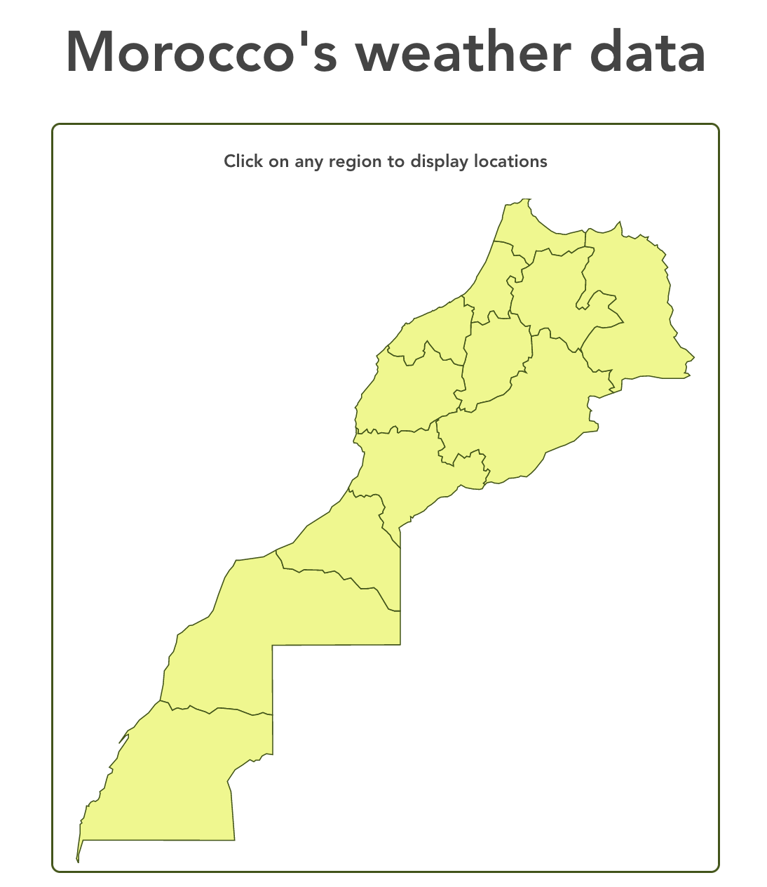

# Dataviz weather project

Weathers data visualization project

## Progress report

- Discussing the plane

- Choosing the framework to use

## Resources

- [Morocco cities](https://simplemaps.com/data/ma-cities)

- [Morocco map GEOJson](https://github.com/manalhama/Morocco-geojson/blob/master/maroc.geojson?short_path=99993c0)
